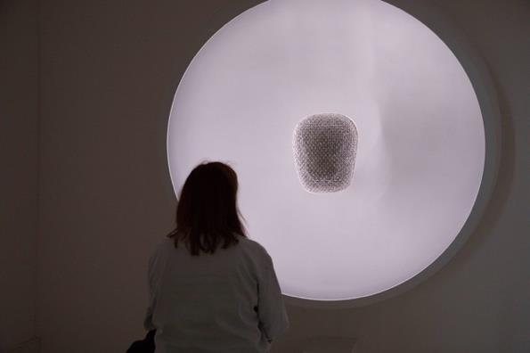

The project began as a proposal Zéphir wrote for the Art & Cognition course at ENS-PSL. A session at Sony CSL Paris, where research, creativity and technology are woven together, sparked the wish to collaborate there, and the course's final project was a chance to propose something linking art and cognition.

Its question: **to what extent can art and technology support the discovery of mindful practices, and instil a little sense of peace in an increasingly chaotic world?** A second aim was to measure the effect on attention and awareness, emotional regulation, and relaxation and bodily grounding.

Zéphir's interest lies where art, science and zen meet: immersive installations and ephemeral events that bring a sense of wonder back to our surroundings, peacefully. The proposal also says, simply, that Zéphir sometimes faces anxiety too, and wanted to imagine ways to ease it for others as well.

## Where it came from

*Réespiration. Photo: S. Bianchini.*

For a year, Zéphir had been running a pilot study on [*Réespiration*](https://reespiration.org/), an installation from a research team at the Pitié-Salpêtrière hospital and EnsadLab. An abstract chest-like object breathes with the person in front of it, their breath read without contact by a thermal camera. The dish around it softly lights the object and plays a contemplative score in time with the breathing.

Ten participants experienced it twice, once fully interactive and once still and silent. Their first accounts were striking in their **heterogeneity**. Some described profound relaxation, even meditative or hypnotic-like states. Others found the same experience oppressive or disengaging. An immersive work doesn't produce a single effect. It meets whoever arrives.

## Non-ordinary states

Stress and anxiety are rising, and so is interest in non-pharmacological ways to feel well and see things differently. The proposal drew on research into **non-ordinary states of consciousness**: shifts away from everyday waking awareness that can come through meditation, hypnosis, trance or mind-body practices, and that may lead to lasting changes in perception, values and behaviour. Biofeedback systems help people calm their own bodies. Immersive art and VR are being explored for their ability to open these states.

## What the new proposal changed

Compared with *Réespiration*, *A Space For You* would be:

- **public**: somewhere anyone could walk into, in the most natural setting possible, not a hidden hospital room;
- **light**: modular enough to set up anywhere without a team of technicians, even outdoors with headphones;
- **collective**: not only about breath, and responsive to a group;
- **primed**: testing whether a welcome from a performer and a guided voice deepen the experience;
- **lasting**: comparing it with a meditation app, to see whether it helps people keep practising.

## The room

A closed room with the blinds drawn. Big beanbags spaced out. Smart lights connected to a computer that can change them live: soft coloured panels on the ceiling for a dynamic sky, and lamps with abstract shades around the room to spark curiosity. Surround sound, a microphone, and sensors for heart rate, breathing and skin response, from a research vest or a smartwatch. A first version could skip the sensors entirely.

It could run as an exhibition or in research mode, with participants' consent to record their data.

## Three sequences

1. **Explore.** A performer welcomes people to a new art and science experiment designed to foster peace and presence, and offers them a sensor vest so the room can sync with them. They wander while contemplative music plays and the light follows the group's physiology: the more relaxed the room, the softer the light and sound, tending towards low violet, which research links with positive emotion. Anyone can speak a sentence about how they feel into a small soundproofed microphone, and the light takes on their feeling, mixed with everyone else's.
2. **Contemplate.** A recorded voice invites everyone to lie down. The light and sound stop following the group and start leading it, slowing towards calm. A 15-minute guided meditation, a body scan and guided imagery towards peace for oneself and others, is written with a teacher from the Plum Village Zen tradition.
3. **Land.** The light brightens to wake people gently. They can stay another 15 minutes to talk, move slowly, or simply enjoy the moment.

## Light and sound

The light would be composed with [Funiki](https://csl.sony.fr/projects/funiki/) ([concept video](https://youtu.be/i7riCaAyB6A)), Sony CSL's system for dynamic atmospheres, which is how the project first reached us. Funiki maps virtual light sources onto whatever physical lights a room has, the way Dolby Atmos maps sounds to speakers, so the installation could travel. It can also turn a sentence into a lighting scene, which is how a whispered feeling would become light.

The music would reuse *Réespiration*'s score by H. Scurto: virtual instruments playing together, adapting to breath, fed here by the group's average breathing.

## And a study

The proposal sketched an experiment comparing the full experience with the same room without the guided meditation, and later perhaps the meditation alone at home. Measures before and after would include:

- heart, breathing and skin response, expecting stronger relaxation with the meditation;
- the State-Trait Anxiety Inventory, expecting lower anxiety;
- the State Mindfulness Scale, for attention to the present and openness to experience;
- and space for people to describe the experience in their own words.

Participants would be healthy adults new to mindfulness, since the question was about discovering these practices. It also named the practical limits honestly: authorisations for research in public spaces, expensive sensors, live data, and the staff needed to run it.

> A space to pause, for individual introspection, grounding and relaxation, but collectively, so participants can exchange on their experiences afterwards.

That word *collectively* is the seed that later grew into belonging, and the soft ceiling of light eventually became a cloud.
