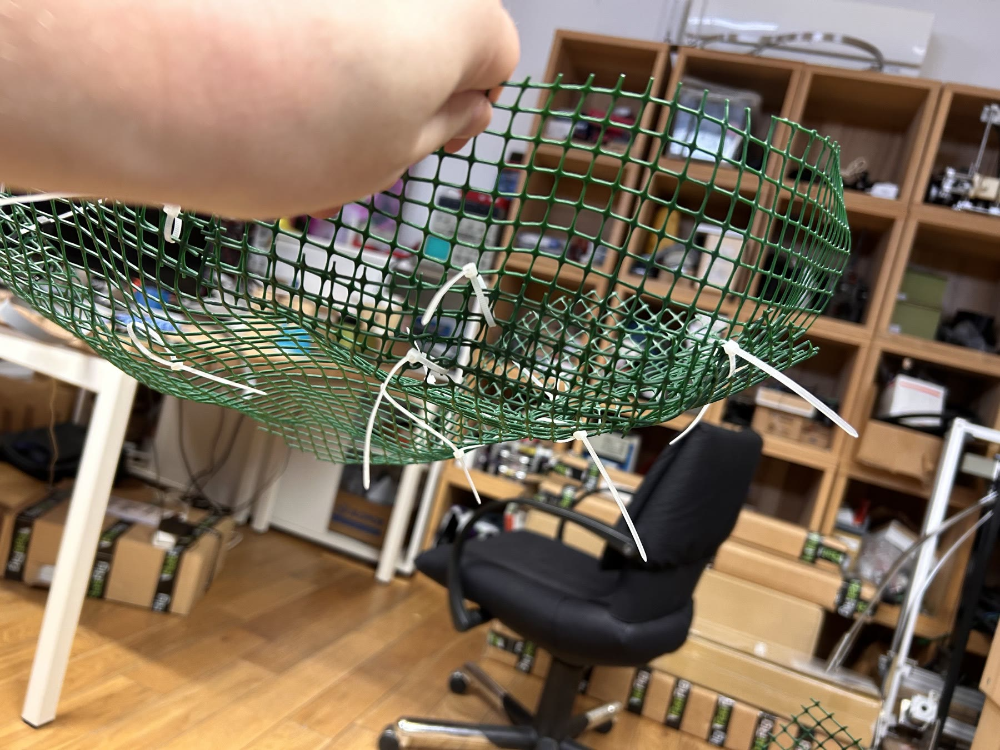
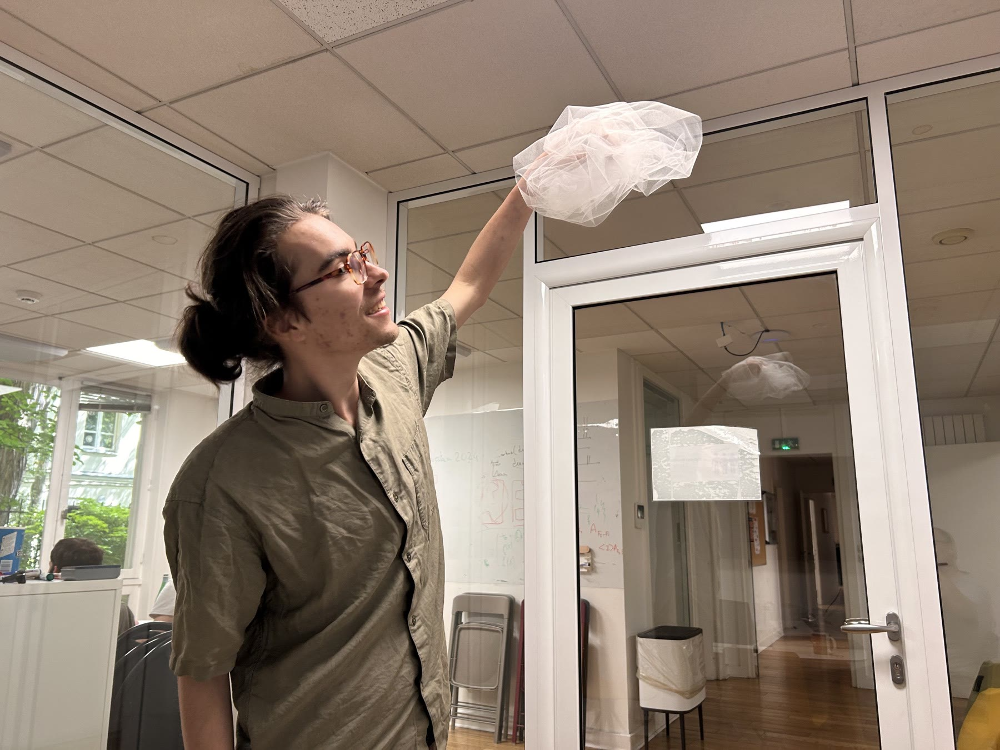

We finally got our hands on materials.

## Plastic chicken mesh and zip ties

The mesh is easy to cut and, once crumpled, starts to hold a surface. Small zip ties add local folds. To join two sheets, you attach them, let one curve, and cut slits into the other so it can follow the curve. For rigidity we tried skewers threaded through zip-tie loops, and rubber bands seated in small notches.

## Tulle

The surprise of the day. Tulle is **very light**, looks surprisingly good, and is almost transparent in a single layer. It became a candidate for the cloud's filling, and later its skin.

## What breath taught us before

We went back over what was hard about breath in *Réespiration*:

- the system **didn't know who was interacting** with it;
- different people's breath signals are **hard to align**;
- a **single output** is hard to read. A single output plus a guide track is easier, but how long can people keep it up once the guide goes away? **Multiple outputs** make each contribution visible. Maybe each person has their own cloud above them?

That led to the arc the installation still follows: **from being fully absorbed in a signal, to backing off and turning towards each other.** Perhaps some keep the light alive while others talk.

## From the literature

From Baumeister & Leary (1995): what matters is the *quality* of ties, not their number. Going from zero close relationships to two makes a world of difference; going from twenty to twenty-two changes little. People feel close to those who went through something with them. And they recover from a broken bond best by forming a new one.
