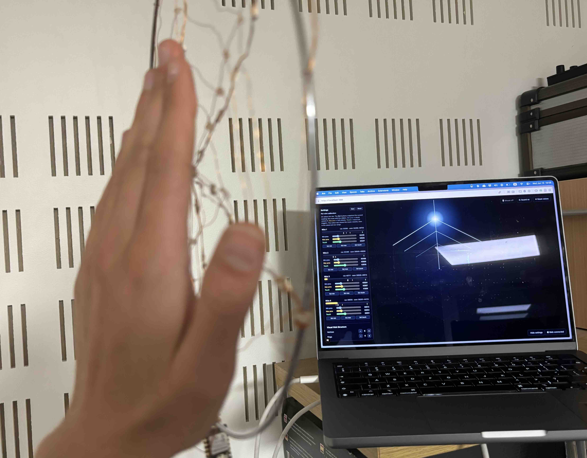
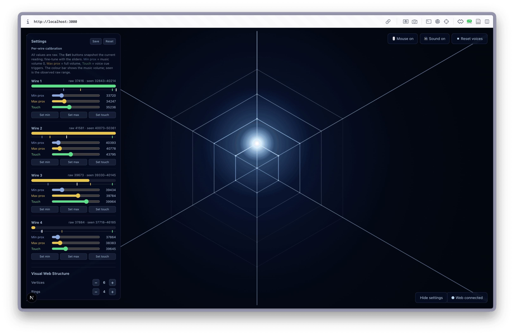
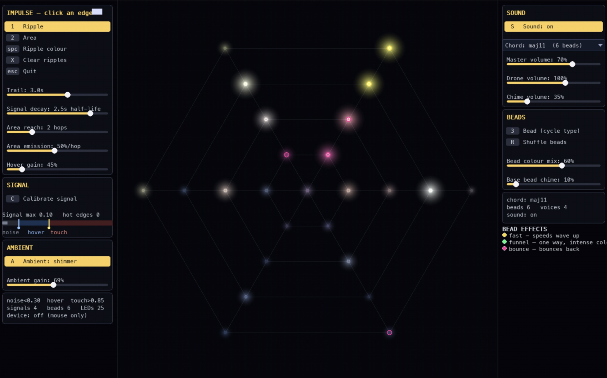

In June, Sony CSL Paris welcomed the [Institute for Future Technologies](https://ift.devinci.fr/) for a two-day workshop on **Sensitive Machines**. Researchers, artists, designers and students formed small multidisciplinary teams to prototype interactive, responsive systems across software, hardware and materials. Thanks to David Colliaux and Aliénor Lahlou for organising it.

Zéphir and I were in a team with Mariana Tamashiro, Paul-Peter Arslan and Thomas Juldo. Our starting point was a web: something you reach towards rather than press, that notices you before you touch it. Over the two days it became two prototypes.

## Sensitive Webs

The first is a dream-catcher-style web of enamelled copper wire, wired into a XIAO ESP32-S3 that senses capacitance on each wire. It turns your gestures into a sonic atmosphere and invites you to notice how you feel.

Each wire is a ring of the web, with two layers of response:

- **Bringing your hand near** a wire slowly raises an ambient tone for that ring.
- **Touching it** plays a short spoken cue.

Each ring has its own tone and its own theme of cues: greetings and goodbyes, invitations to stay with your current posture and feeling, in- and out-breath guidance to help you attend to bodily sensation, and prompts to recall last night's dreams.

The on-screen web mirrors the physical one. A settings panel calibrates each wire live: where proximity sensing starts, where the music reaches full volume, and where a touch fires a cue. That matters because every wire, hand and room reads differently.

Zéphir's repository has the interface, the firmware and the voice cues: [zephirl/sensitive-webs](https://github.com/zephirl/sensitive-webs).

## A web you play with light

The second prototype is a spider-web you play like an instrument, built for a physical web of LEDs with capacitive touch.

- **Touch a strand** and a ripple of light runs across the web while a chime rings out.
- **Press harder** and the ripple grows into a wave that spreads through the whole structure.
- **Beads** along the strands bend the light: some speed it up, some funnel it one way, and some bounce it back.

Underneath, an ambient glow shimmers, breathes or twinkles across the web, and a drone chord follows what you do: the more you play, the richer it gets.

You can [play it in your browser](https://mbanslow.github.io/ift-x-csl-web-lights-sounds/) without any hardware. The repository also has a desktop version and an installation mode that drives real LEDs through an ESP32: [MBAnslow/ift-x-csl-web-lights-sounds](https://github.com/MBAnslow/ift-x-csl-web-lights-sounds).

## What we took from it

The two prototypes are halves of one idea. Sensitive Webs listens closely and answers with sound and voice; the light web answers with light moving through a structure. The next step is to bring them together, so the physical web lights up as you approach it and its sound changes with the light. A second workshop is planned for autumn 2026 to do that.

For *Cloudfulness*, it was a chance to test ideas we care about in a lighter form: a material that responds before you touch it, guidance that invites rather than instructs, and light and sound that feel like one gesture.
