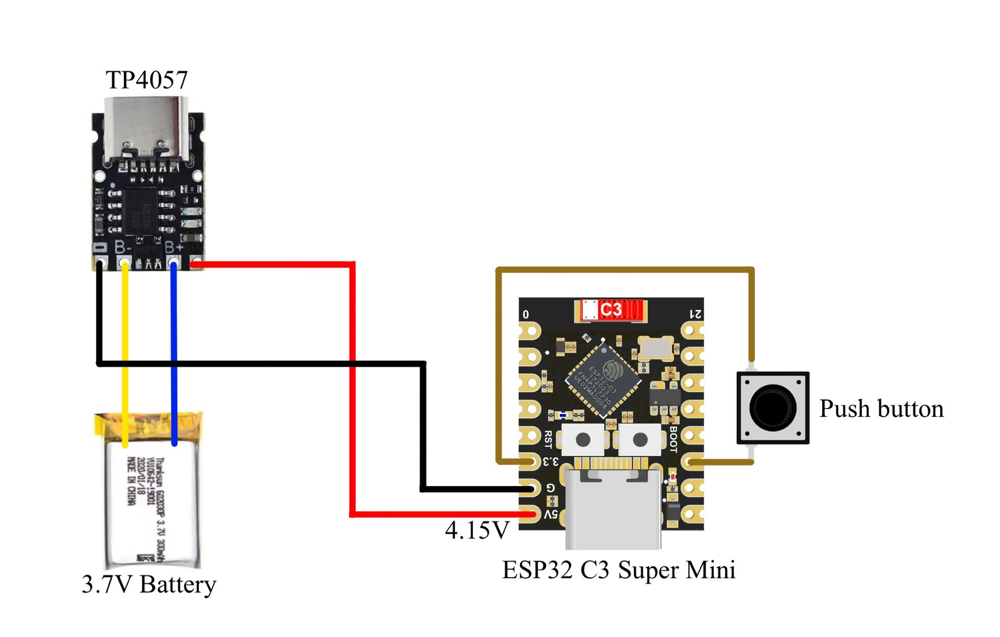

To let the cloud listen, each participant needs a way to share their breath that is **cheap, comfortable and robust**. Research-grade respiration belts cost hundreds of euros each. We built our own.

## The belt

Zéphir designed a vest-like wearable with a stretch sensor band around the torso. Its reading changes as the chest and belly expand. A small **ESP32-C3** board reads the sensor and runs on a 3.7 V battery with a charging module and a push button, so participants aren't tethered by cables.

The firmware went through a few simple stages: printing one analogue value over serial, reading two sensors at once, then sending the breath value over Wi-Fi as **OSC** messages (`/breath/breath0`). A TouchDesigner patch receives them, smooths the signal, and works out when an in-breath or out-breath begins, using a lagged trail and a threshold window.

## Which band hears a breath?

We recorded raw readings while breathing with bands of different widths (two 5 cm bands, one 10 cm, one 20 cm) under 1 cm and 4 cm of pre-stretch. The results are on the [installation page](../../installation/#breath). The narrow bands barely registered a breath above the noise. The **20 cm band** gave a clear, readable wave.

Next steps on our roadmap: fix the sensors into belts, get the battery-powered versions working, and test breathing while moving as well as seated.
