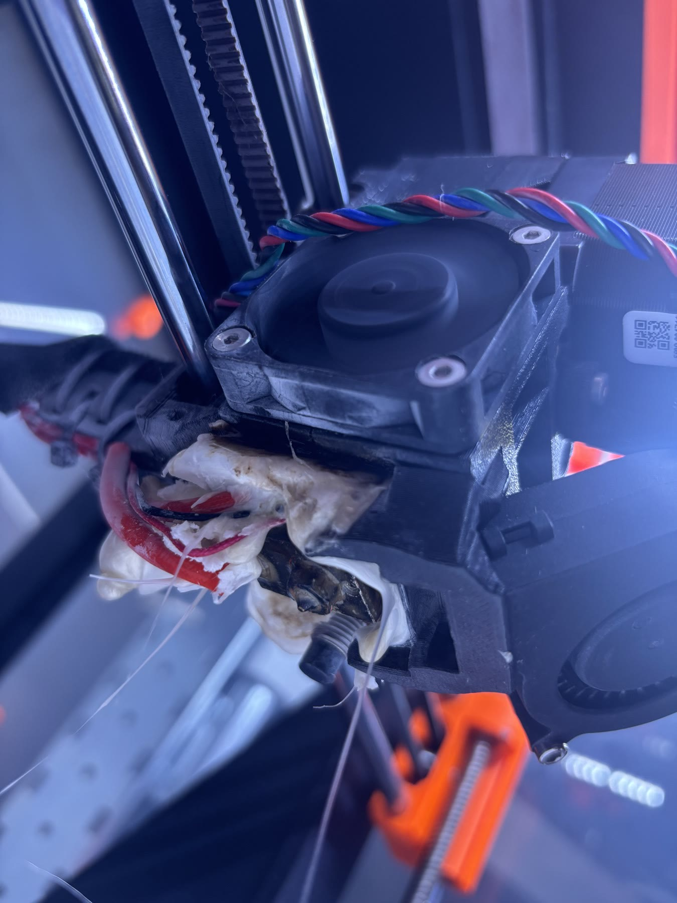

Tulle is light and beautiful, but it doesn't hold a shape on its own. Hung from a single point, the cloud collapses into a drape. To keep its volume, carry LEDs inside it, and survive being packed up and rebuilt in another venue, it needs an internal structure.

We modelled a **pyramid-like frame** and split it into printable parts, labelled A to E. After the first test prints, we revised them into a second set ("bis" versions), adjusting how the pieces fit together.

What we're working out next is how the printed parts, a metal frame for hanging, and elastic lines come together, so the tulle can move and still keep its approximate shape.

*Update:* a few days later the printed parts became joints for a wooden pyramid that carries the lights. See [A pyramid of light](../2026-07-22-a-pyramid-of-light/).
