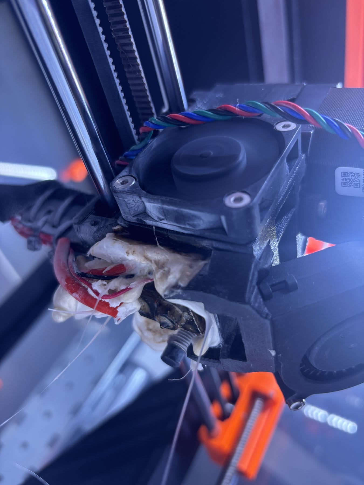

Tulle is light and beautiful, but it doesn't hold a shape on its own. Hung from a single point, the cloud collapses into a drape. To keep its volume, carry LEDs inside it, and survive being packed up and rebuilt in another venue, it needs an internal structure.

We modelled a **pyramid-like frame** and split it into printable parts, labelled A to E. After the first test prints, we revised them into a second set ("bis" versions), adjusting how the pieces fit together.

This is the model we printed from. Later, for the LED mapping, I added the green planes in Blender: they stand in for the mesh walls that would be stretched across the frame, so I could place each LED where it would actually sit on the mesh. Drag to turn it around.

<figure class="model-figure">
  <model-viewer
    src="../../models/pyramid-walled.glb"
    alt="3D model of the pyramid frame: white printed edges and joints, with green planes filling each face where the mesh walls sit"
    camera-controls
    auto-rotate
    shadow-intensity="0.6"
    environment-image="neutral"
    style="display: block; width: 100%; height: min(28rem, 70vw); background: #1b2440; border-radius: 1rem;"
  ></model-viewer>
  <figcaption>The printed frame, with the planes I added for LED mapping.</figcaption>
</figure>

## When the print went wrong

Not everything went to plan. On the printer at Sony CSL Paris, one print failed badly: instead of building up a part, the filament set into a solid blob around the hot end, swallowing the nozzle, the heater wires and part of the print head.

What we're working out next is how the printed parts, a metal frame for hanging, and elastic lines come together, so the tulle can move and still keep its approximate shape.

*Update:* a few days later the printed parts became joints for a wooden pyramid that carries the lights. See [A pyramid of light](../2026-07-22-a-pyramid-of-light/).
