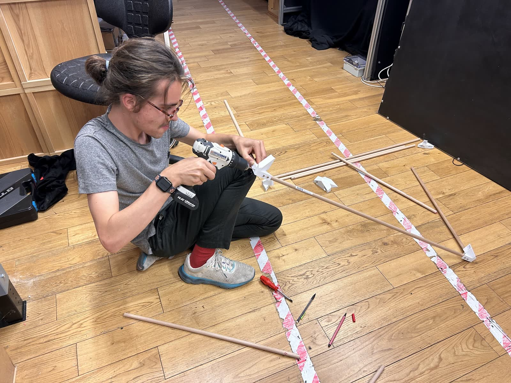
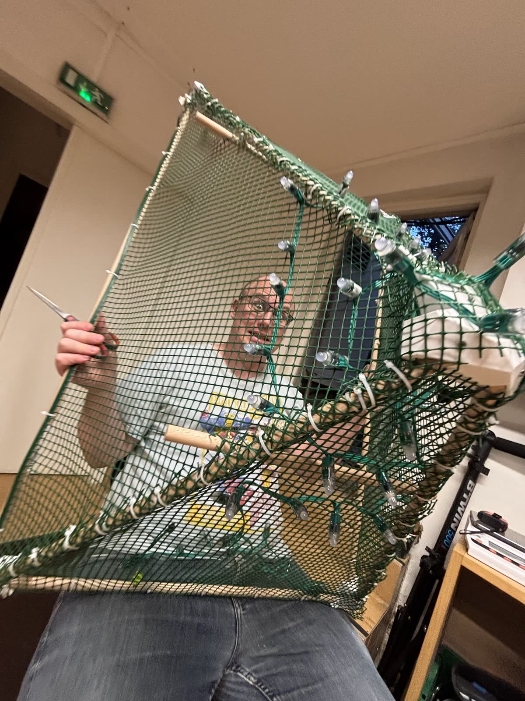
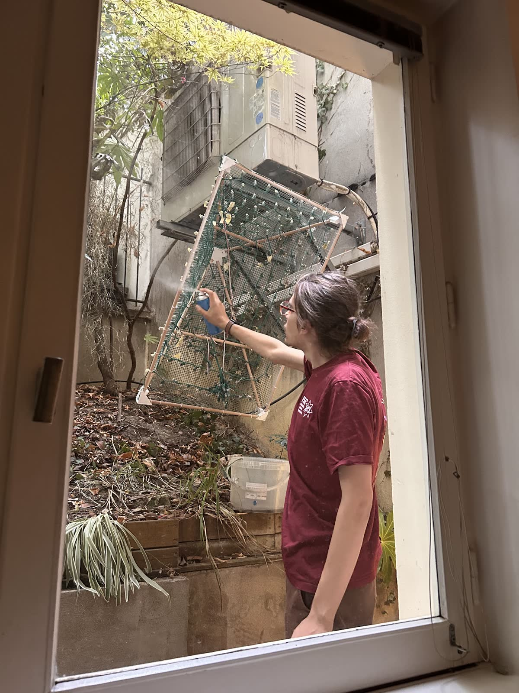
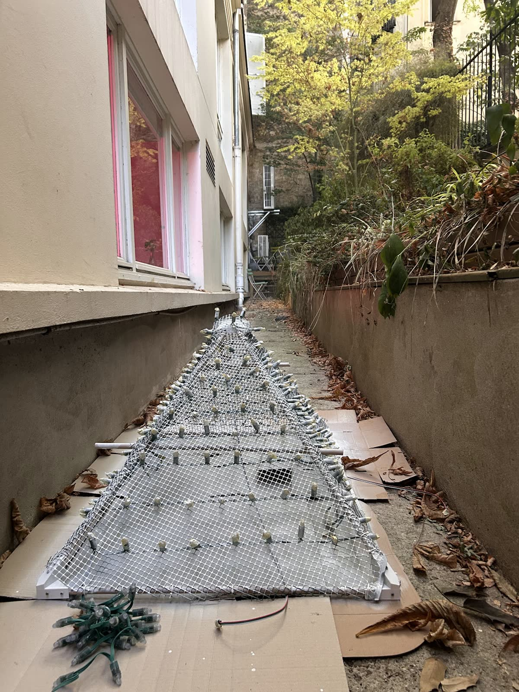

The printed parts from last week turned out to be joints. Wooden dowels slot into them, and together they make a low pyramid: light enough to hang, and easy to take apart again.

## The mesh comes back

In May, green plastic garden mesh was our first attempt at a cloud body. It was too heavy-looking and too opaque, and we moved on to tulle. Now it came back as a skin for the skeleton. Stretched over the dowels and tied at every edge, it gives the lights something to hold on to.

Strings of addressable LED pixels are zip-tied across each face in rows, every bulb pointing outwards. Each pixel can take its own colour, which is what makes gradients, travelling light and lightning possible. A pyramid places those pixels at different depths inside the cloud, so light can seem to move *through* it rather than across a flat panel.

## Painting it white

Green mesh under white fibre would tint every colour we tried to make. So the frame went out to the courtyard and was spray-painted white, dowels, mesh, joints and all.

Next, it needs a body: something soft and cloud-like around it that the light can glow through.
