At the end of July we put everything together for the first time: the lit pyramid, a body around it, the breath belts, and a room to lie down in.

## A body of fibre

We knew from the [cloud bottom in June](../2026-06-22-light-from-within/) that loose polyester fibre, the kind used to stuff cushions, glows beautifully. On the 24th we heaped it over the lit pyramid. The individual pixels disappeared, leaving a soft, uneven glow with darker folds.

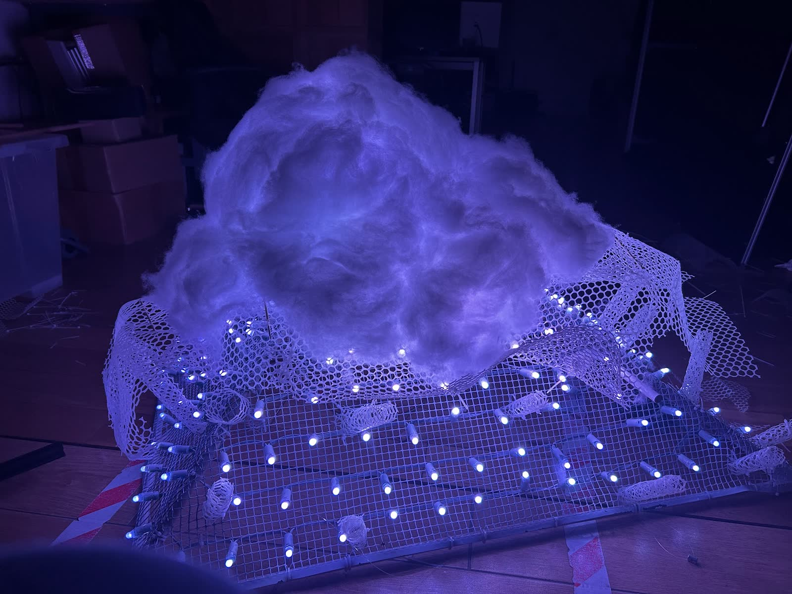

Fibre on its own slumps and drifts, so it needed a shell. We cut a white plastic mesh with hexagonal cells and layered the fibre over it, then pinned it in place with **bamboo skewers** threaded through the mesh. Dozens of them, each holding a tuft where we wanted the cloud to billow.

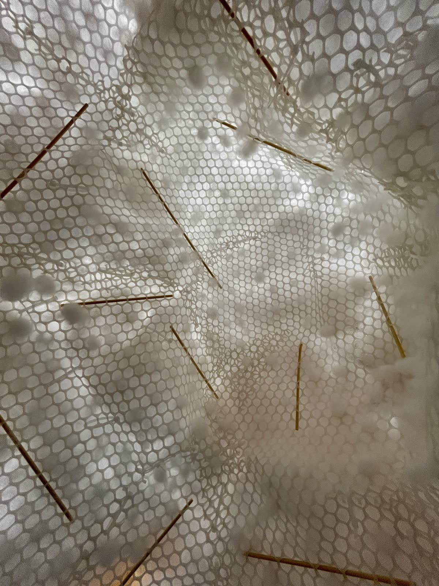

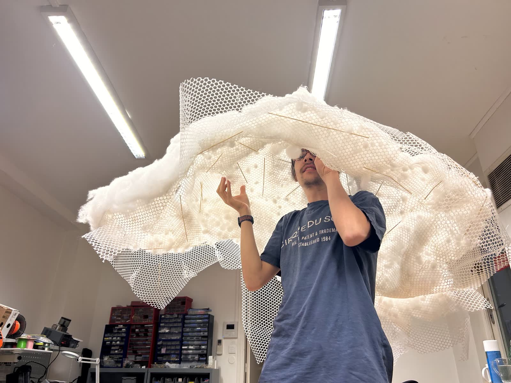

Once it hung from the ceiling, the last of the shaping happened lying down, looking up at it, pushing fibre in from below one skewer at a time.

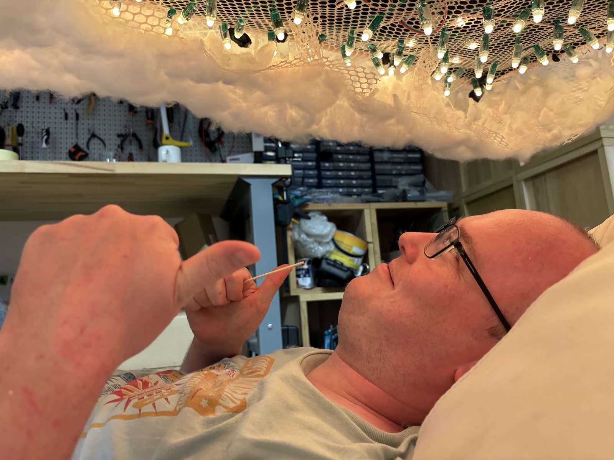

## Light and heat

Inside, the pixels hang on the white mesh in rows. A QuinLED ESP32 controller with an Ethernet port and fused outputs drives them, and TouchDesigner runs the show: it reads the breath belts and sends light to the cloud.

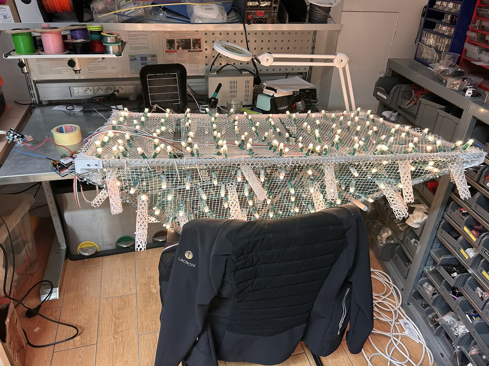

Hundreds of LEDs and their wiring wrapped in polyester fibre is something to check, not assume. We went over the electronics with a thermal camera before anyone lay underneath. It read around 27 °C.

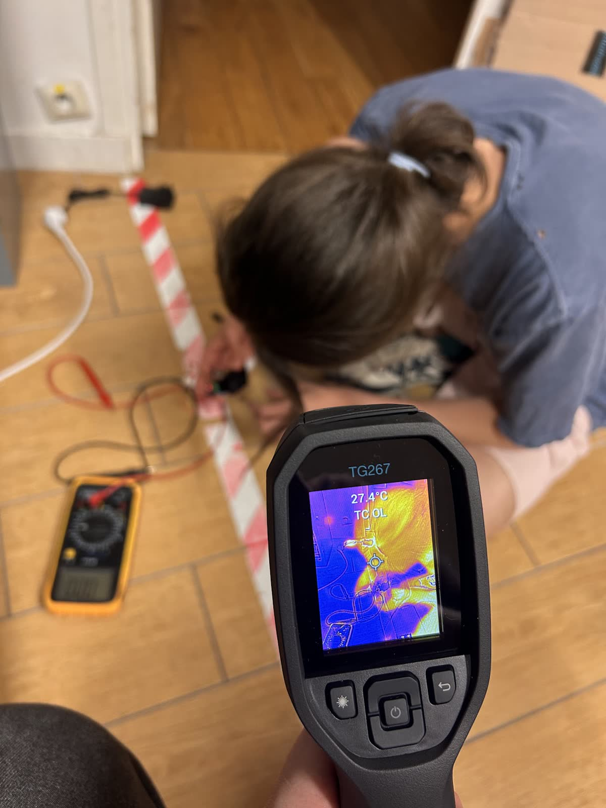

## A corner of sky

We closed off a corner of the studio with a blue backdrop and black panels, laid white sheets on the floor, and added beanbags. A pot of tea sat warm on a small pedestal under the cloud, and glasses were poured for the people sitting beneath it.

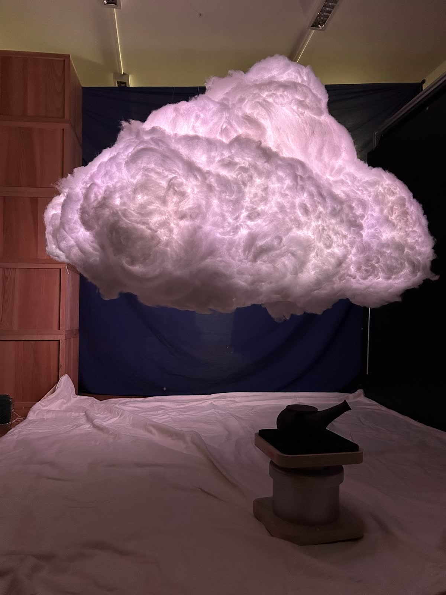

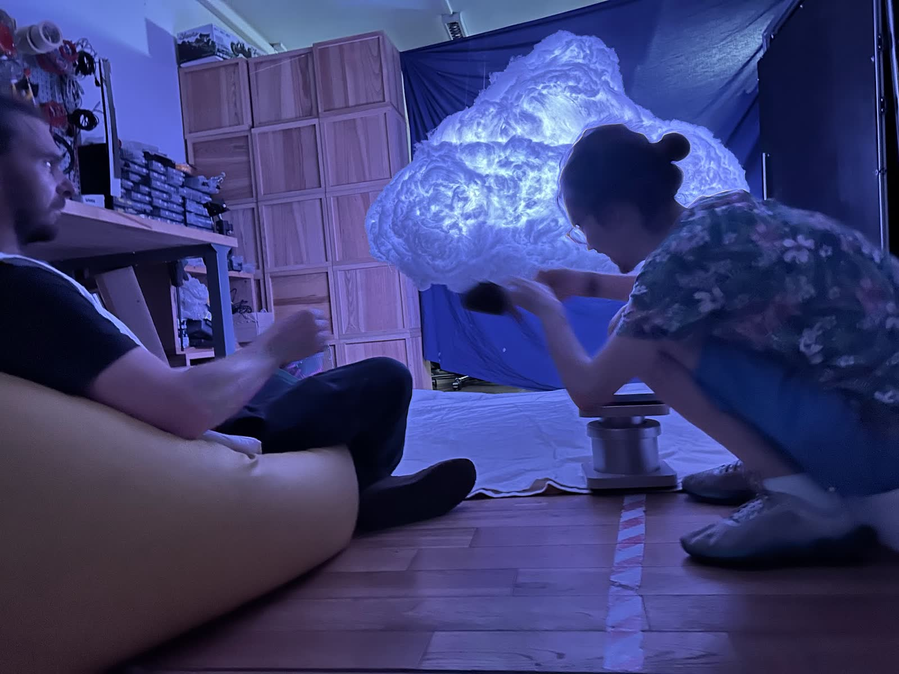

Over the afternoon and evening of the 29th and again on the 30th, people took turns lying or sitting beneath it. The cloud moved through warm amber, violet, magenta and deep blue, with lightning flickering through the fibre, while the breath signals scrolled across the TouchDesigner screen at the side of the room.

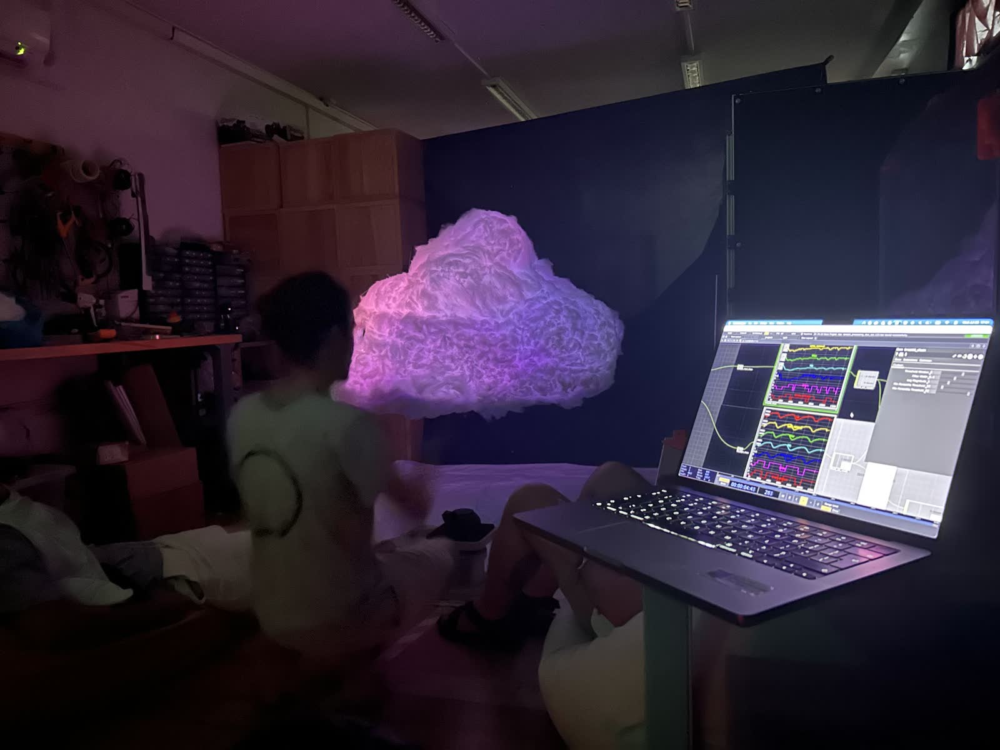

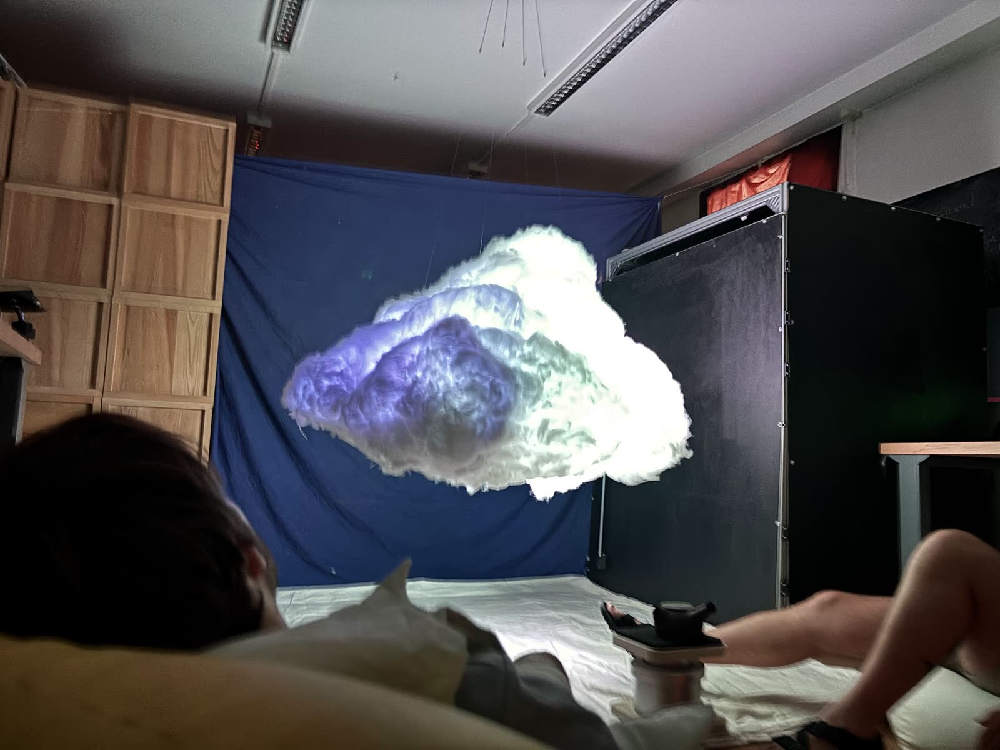

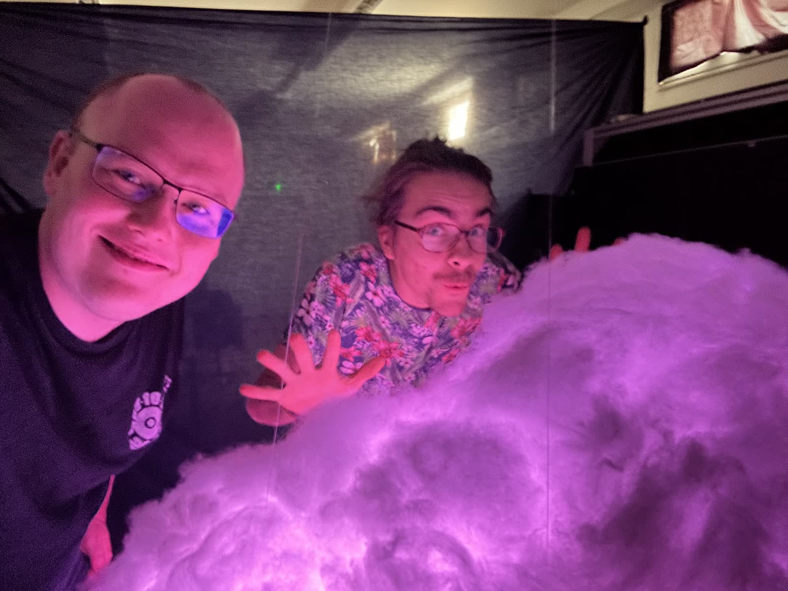

It is an alpha: built in ten days in a workshop, with tape on the floor and the wiring in view. But for the first time, it was a cloud you could lie under.
